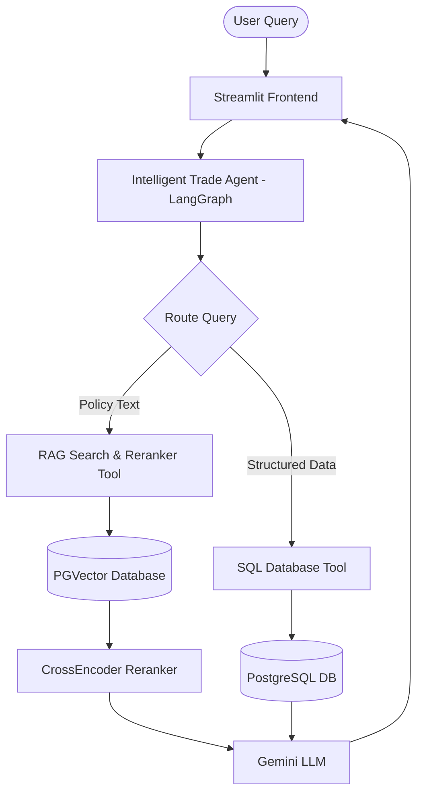

# TradeMind AI: Intelligent Trade Agent 📦🧠

TradeMind AI is an advanced, AI-powered agentic system designed to assist with international trade queries, tariff research, import/export rules, and trade policy documentation. The system provides real-time trade intelligence for Indian international trade by combining structured trade data with unstructured policy guidelines.

The system leverages **LangGraph** to coordinate a multi-tool agent that dynamically routes queries between structured databases (using SQL) and unstructured documents (using PGVector and RAG). By integrating a local semantic re-ranking step with a Cross-Encoder model, TradeMind AI ensures that the retrieved policy contexts are highly accurate and relevant, preventing hallucination and providing reliable citations.

---

## 🏗️ Architecture Overview

The system operates as a hybrid agent that dynamically leverages two tools based on the user's query:
1.  **SQL Database Agent:** Queries structured relational tables containing detailed HS Codes, tariffs, and rate lists (e.g. RoDTEP).
2.  **Retrieval-Augmented Generation (RAG) Agent:** Performs semantic search across unstructured PDF policy manuals, utilizing a **CrossEncoder** model for semantic reranking of retrieved contexts to provide highly accurate citations.

Both tools are orchestrated by a **LangGraph state machine** that manages context memory and conversational state. The interface is served via a responsive **Streamlit** dashboard.



---

## 📂 Directory Structure

The project files have been structured and categorized logically to match your local repository configuration:

```
TradeMind AI/
├── config.py                  # Centralized credentials & settings
├── requirements.txt           # Python dependencies
├── requirements_pinned.txt    # Pinned dependency versions
├── run.py                     # One-click launcher
├── README.md                  # This file
│
├── agents/                    # AI Agent modules
│   ├── __init__.py
│   └── intelligent_trade_agent.py   # Main trade agent (SQL + RAG + Re-ranking)
│
├── app/                       # Streamlit web application
│   └── app.py                 # Chat interface
│
├── data_ingestion/            # Data loading package
│   └── __init__.py
│
└── notebooks/                 # Original Jupyter notebooks (reference & setup)
    ├── Agentic_RAG_for_FTP.ipynb
    ├── Gemini_VectorDB_Setup.ipynb
    ├── Langgraph_Agent.ipynb
    ├── Master_agent.ipynb
    ├── SQL_Agent.ipynb
    ├── Streamlit_master_agent.ipynb
    ├── VectorDB_Setup (1).ipynb
    └── Vector_Import_policies.ipynb
```

---

## 🚀 Quick Start

### 1. Install Dependencies
Ensure you are in the project root and install dependencies inside your virtual environment:
```bash
pip install -r requirements.txt
```

### 2. Run the App
To run the Streamlit app on Windows:

*   **Option 1: Direct execution (Recommended)**
    ```powershell
    .venv\Scripts\python.exe run.py
    ```
*   **Option 2: Activate virtual environment first**
    ```powershell
    .venv\Scripts\Activate.ps1
    python run.py
    ```

The app will start at **http://localhost:8501** (or automatically prompt the next available port if 8501 is taken).

### 3. Ask Questions!
Try queries like:
- *"I want to import green peas"*
- *"What is the RoDTEP scheme?"*
- *"How does milk export works?"*
- *"What are the EPCG scheme rules?"*

---

## ⚙️ Configuration

All settings are in [config.py](file:///d:/WorkSpace/TradeMind AI/config.py):
- **Gemini API key**: Configured under `GOOGLE_API_KEY`.
- **Supabase PostgreSQL connection**: Connection string pointing to Supabase hosting.
- **Model Selection**: Set to `gemini-flash-lite-latest` to avoid strict API key quota restrictions.

---

## 🔧 Developer Setup in VS Code

If you see red squiggly lines on imports (like `sqlalchemy` or `langchain`), you need to tell VS Code to use the virtual environment interpreter:

1. Press **`Ctrl + Shift + P`** to open the Command Palette.
2. Select **`Python: Select Interpreter`**.
3. Choose the option pointing to `(.venv: venv)` or `.\.venv\Scripts\python.exe`.
4. If it doesn't apply immediately, run **`Developer: Reload Window`** in the Command Palette to reboot the VS Code Python extension.

